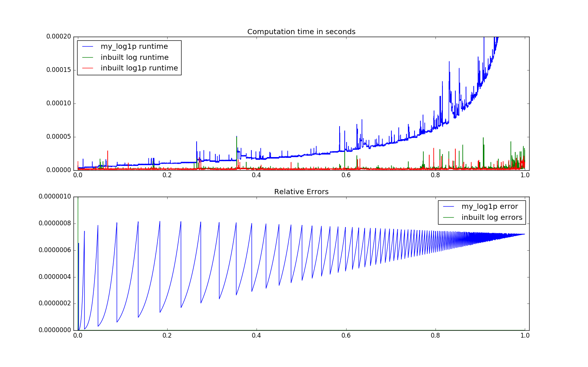

##Question 1. Part A).

### The values of x that lead to most inaccurate result in terms of relative error.
For `my_log1p(x)` the values of x which leads to the most inaccurate result are values which greater than 1. This is due to the fact that the *degree* of each term grows with `n`, which results us taking `x^n`. When x is greater than 1, the term `x^n` diverges as n grows. Consequently, the Taylor expansion fails to converge to an accurate value for `log(1+x)`. 

Hence, an input of x greater than 1 will result in the function diverging and returning an error due to overflow.

### Identify/describe the adv/limitations of using the above expansion

The advantages:

* This implementation of log1p is able to compute values which are much smaller than machine epsilon very accurately to the reference inbuilt `np.log1p(x)`.
* The output converge to an acceptable output within an acceptable time for x between 0 and 1.

The disadvantages:

* None linear complexity compare to the other inbuilt algorithms. (See figure 1)
* Can only be used for $x\in[0,\ 1]$.
* It's less accurate than the inbuilt `log(1+x)` for range of x between machine eps and 1

### Specify the value of x for which you would use the expansion over the inbuilt.
Summarising the above advantages and disadvantages. We can conclude that the only usable range for `my_log1p(x)` is for $x\in[0,\ \epsilon], \ where \ \epsilon = 2.22044604925*10^{-16}$.

Observe the graph below showing the relative errors. The function `my_log1p` produces good results even when the input are much less than machine eps. However, the inbuilt log function was unable to handle the addition `x+1` for x being less than machine eps. Consequently, the huge error spike in green towards 0.

Furthermore, `my_log1p` runtime tends to be much slower compare to the inbuilt `log` function as $x$ grows. Hence, rendering it less desirable compare to quicker and more accurate alternatives.

*Figure 1: (top) Computation time and (Bottom) relative error of the algorithms.*