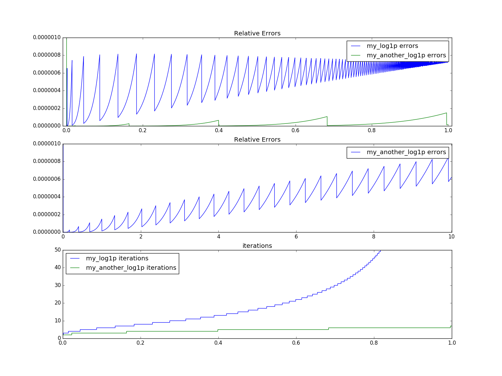
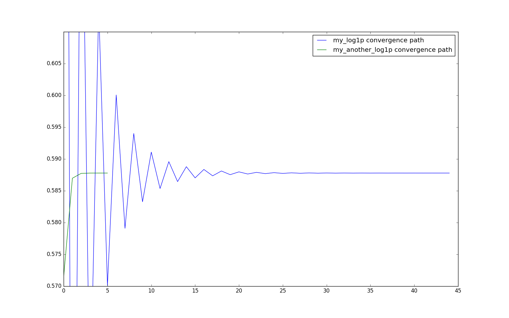

## Question1. Part B)

### Work out the expansion of $\log(1+x)$ as $\log(\frac{1+y}{1-y})$

Note: the Taylor series expansion for $\log(1+x)$ is:
$$\log(1+x) = x - {x^2\over 2}+{x^3\over 3} - {x^4\over 4} + ...+\frac{(-1)^{n+1}x^n}{n} + ... = \sum_{n=1}^{\infty} \frac{(-1)^{n+1}x^n}{n}$$

First, let $\frac{1+y}{1-y} = 1+x$, then:
\begin{align\*}
\log(1+x) &= \log(\frac{1+y}{1-y}) \\\
&=\log(1+y) - \log(1-y)
\end{align\*}

Using Talyor series to expand the expression above:

\begin{align\*}
\log(1+y) - \log(1-y) =& \sum\_{n=1}^{\infty} \frac{(-1)^{n+1}y^n}{n} - \sum\_{n=1}^{\infty} \frac{(-1)^{n+1}(-y)^n}{n}\\\
=& y - {y^2\over 2}+{y^3\over 3} - {y^4\over 4} + ...-[-y - {(-y)^2\over 2}+{(-y)^3\over 3} - {(-y)^4\over 4} + ... ]\\\
=& y - {y^2\over 2}+{y^3\over 3} - {y^4\over 4} + ...+y + {(-y)^2\over 2}-{(-y)^3\over 3} + {(-y)^4\over 4} - ... \\\
=& y - {y^2\over 2}+{y^3\over 3} - {y^4\over 4} + ...+y + {y^2\over 2}+{y^3\over 3} + {y^4\over 4} + ... \\\
=&2y+0+{2y^3\over3}+0+{2y^5\over5}...\\\
=&2(y + {y^3\over3}+{y^5\over5}+...)\\\
=&2\sum_{n=1}^{\infty} {y^{2n-1} \over 2n-1}
\end{align\*}

Now, to obtain the final algorithm, we need to solve $\frac{1+y}{1-y} = 1+x$ for $y$.

\begin{align\*}
\frac{1+y}{1-y} &= 1+x \\\
\frac{2}{1-y} - 1 &= 1+x \\\
\frac{2}{1-y} &= x+2 \\\
\frac{1-y}{2} &= \frac{1}{x+2} \\\
1-y &= \frac{2}{x+2} \\\
y &= 1-\frac{2}{x+2}
\end{align\*}

To obtain the function for `my_another_log1p(x)`, simply convert the input `x` to `y` as the expression above. Then compute the sum $2\sum_{n=1}^{\infty} {y^{2n-1} \over 2n-1}$.

###Compare and contrast the result to part a).

*__Figure 1__: (top): relative error between two log1p implementations between 0 and 1, (middle): relative error with larger inputs, (bottom): number of iterations until return value.*

For small values of `x` (smaller than machine eps), $\sum_{n=1}^{\infty} \frac{(-1)^{n+1}x^n}{n}$ is able to converge to a much better result compare to $2\sum_{n=1}^{\infty} {y^{2n-1} \over 2n-1}$, as seen in figure 1, this is because of the fact that in the second method, we convert `x` to `y` via an addition of a constant. When $x\leqslant \epsilon$, the addition yields $x+2=2$, resulting in an incorrect value, hence in 100% relative error. However, the second implementation is able to produce results with much better accuracy when input of `x` greater than machine eps.
Furthermore, the second implementation allows the computation of input `x` greater than 1. This is something that the first implementation is incapable of.
The second implementation is able to converge to a return value much quicker than the first implementation. See Figure 1, bottom graph. 

Taking a deeper look into the two formula, we can see that $\sum_{n=1}^{\infty} \frac{(-1)^{n+1}x^n}{n}$ has an alternating term $(-1)^{n+1}$, this results in the sum alternate around the true value before converging. In contrast, $2\sum_{n=1}^{\infty} {y^{2n-1} \over 2n-1}$ does not have any alternating terms, hence converges to a return value much more quickly. The convergence of the two can be graphed. The additional experiment beyond the scope of the assignment can be found in `q1_experiment.ipynb`.

Observe figure 2 below, the first method alternates about the actual value and finally converges many iterations later, whereas the second method converges to a return value with desired accuracy very quickly. 

*__Figure 2__: fix x = 0.8, the path to convergence of the two implementations.*